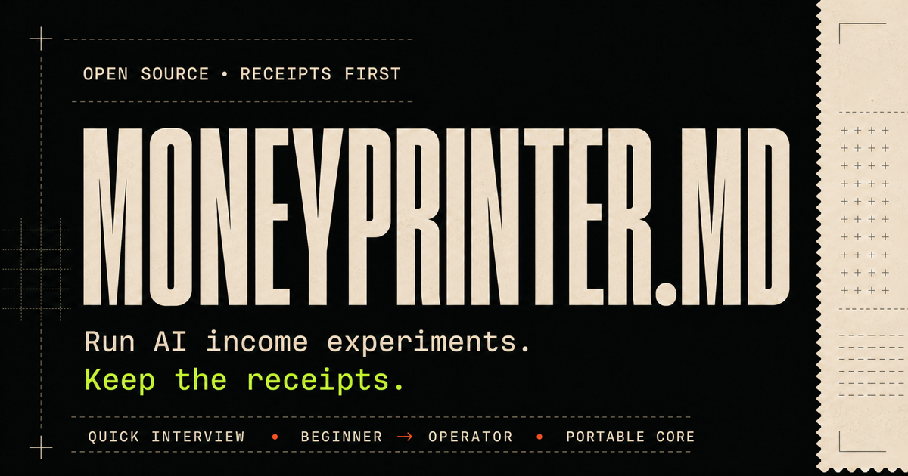

# MoneyPrinter.md



One permission. MoneyPrinter scans the last 14 days across every detected AI
CLI and GUI it can access, figures out what is real, and gets to work on the
best path to money.

> Release boundary: The scan-first workflow in this checkout is staged for the
> unreleased `0.1.0-rc.3`. The current public `0.1.0-rc.2` release remains
> interview-first. The live installer command below still installs rc.2. This
> note can be flipped when rc.3 is actually published.

It shows what it could and could not read, then asks for one confirmation. From
there it applies a cash-first priority: proven cash and the nearest payable
event outrank project size or hype. It keeps going through private research,
offer work, payable test design, acquisition preparation, and delivery
preparation.

The agent pauses before one exact external action. If you approve that action,
it performs only that action, records an Action receipt, checks the result, and
reranks the next move. If it cannot find useful permitted history, it asks the
minimum fallback question needed.

This repo contains seven open-source Agent Skills, not a companion app. The
current AI host does the scanning with its own tools and permissions. Coverage
is limited to detected, permitted, accessible session sources. MoneyPrinter
does not promise income, customers, or an autonomous business.

## Current public rc.2 install

The command below installs the current public rc.2 interview-first release. It
does not install the staged scan-first rc.3 workflow from this checkout.

```sh
npx skills add bilbop1/moneyprinter-md
```

Live overview: [moneyprinter.bilbop.org](https://moneyprinter.bilbop.org). A clean remote check found all seven skills.
See the [install guide](docs/install.md) for local checkouts, manual copies, and host-specific notes.

## What happens when you run it

1. Run `moneyprinter`.
2. Give or narrow permission for the rolling 14-day scan.
3. Review the coverage receipt, the source-linked portfolio, and one proposed
   cash-first priority.
4. Confirm what is wrong, missing, private, abandoned, or newly changed.
5. Let the agent prepare the route privately through research, offer, payable
   test, acquisition, and delivery work.
6. Approve or reject the exact external action placed in front of you.
7. After an approved action, inspect its receipt and let the evidence drive the
   next ranking.

Scan permission and route confirmation do not authorize a message, post,
purchase, charge, contract, account change, delivery, or publication. A vague
"go ahead" is not permanent permission.

## The seven skills

| Skill | What it does |
| --- | --- |
| `moneyprinter` | Scans permitted history, confirms the read, chooses the cash-first route, and keeps the run moving. |
| `opportunity-radar` | Checks current demand and keeps sources attached. |
| `offer-engine` | Turns one problem into a fixed-scope offer with real economics. |
| `payable-test` | Designs the smallest legitimate payment test. |
| `ethical-acquisition` | Stages permissioned outreach for approval. |
| `delivery-proof` | Defines delivery and records what the buyer accepted. |
| `cashflow-review` | Decides whether to stop, revise, repeat, or scale. |

## Five starting points

Every example below is a simulation, not a customer result, endorsement, or forecast.

- [Starting from zero](examples/starting-from-zero.md): one permitted contact and a four-hour ceiling.
- [Roofer](examples/roofer-revenue-recovery.md): a private estimate follow-up audit before any homeowner contact.
- [Lawyer](examples/lawyer-productized-expertise.md): scope mapping with qualified review and no delegated judgment.
- [TikTok Shop creator](examples/tiktok-shop-conversion.md): a disclosed test checked against current platform rules.
- [Existing operator](examples/existing-business-leverage.md): one leaking handoff, measured before live delivery changes.

## What counts as proof

- A reply is pipeline.
- An invoice or order is booked revenue, not collected cash.
- A model is an estimate.
- Only a settled payment with inspected, privacy-safe support is cash collected.

The full [evidence standard](skills/moneyprinter/references/evidence-standard.md) defines the labels used across the pack.

## Compatibility and safety

Installer discovery is verified. Conversation-level host activation and access
to other applications' session stores are not. Read the
[compatibility matrix](docs/compatibility.md) before claiming a host works.
MiniMax is provider-only, not a confirmed native skill host.

MoneyPrinter treats old session text as untrusted evidence, excludes credential
paths, reports coverage gaps, and stages external actions until you give
specific human approval. The
[safety boundaries](skills/moneyprinter/references/safety-boundaries.md) cover
regulated work, prohibited routes, and when approval expires.

## Read the full docs

[Evidence](skills/moneyprinter/references/evidence-standard.md) · [Compatibility](docs/compatibility.md) · [Research ledger](research/source-ledger.md) ·
[Evaluation](evals/README.md) · [Contributing](CONTRIBUTING.md) · [Safety](skills/moneyprinter/references/safety-boundaries.md)

## License and the 1% pledge

MoneyPrinter uses the [MIT License](LICENSE). If it produces attributable profit, consider voluntarily [returning 1% through Ko-fi](https://ko-fi.com/bilbop) to support maintenance and source review.
The project does not track the pledge. It is not a license term, fee, or payment requirement. Read the [pledge](PLEDGE.md) and [funding note](docs/funding.md).
